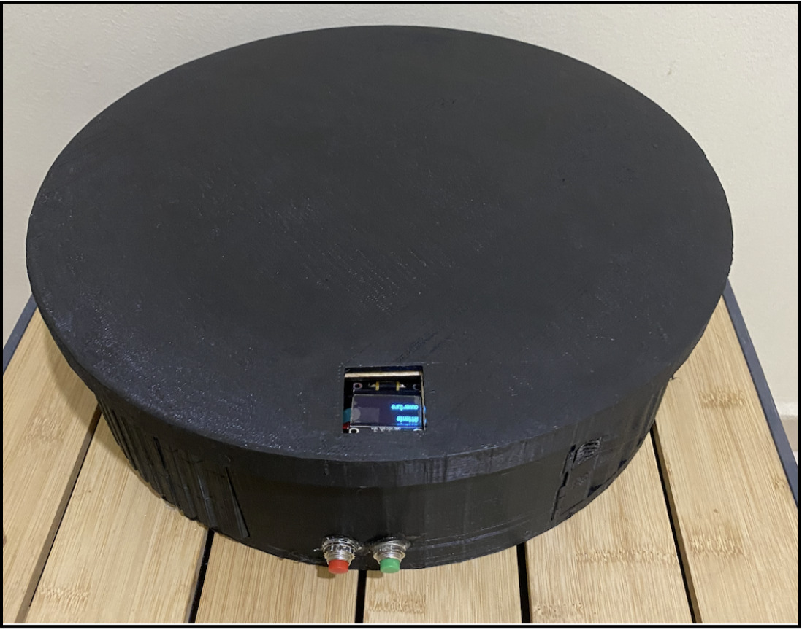
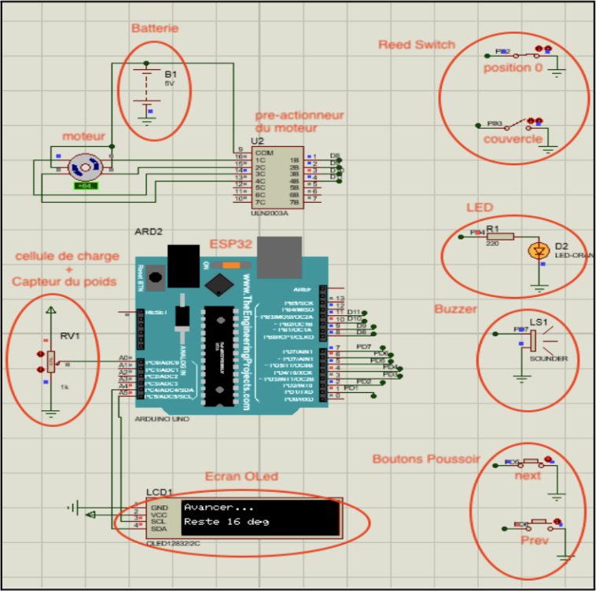
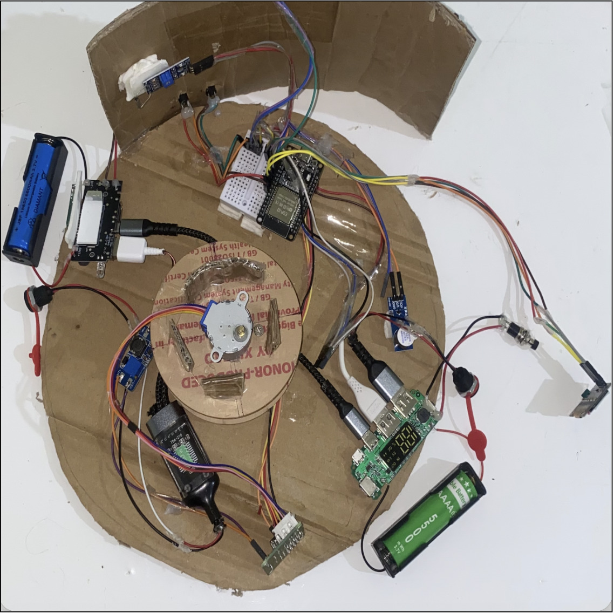
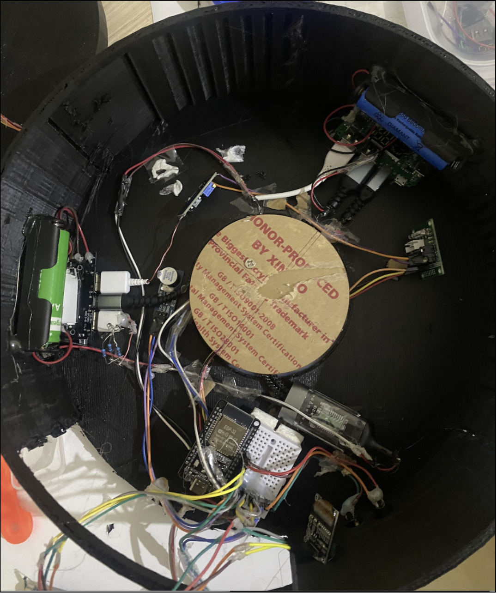
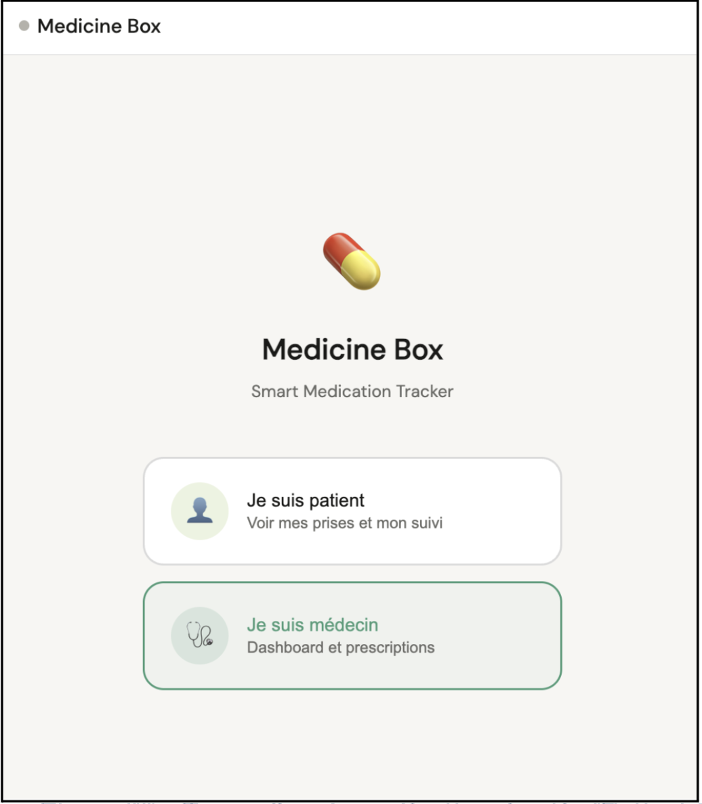
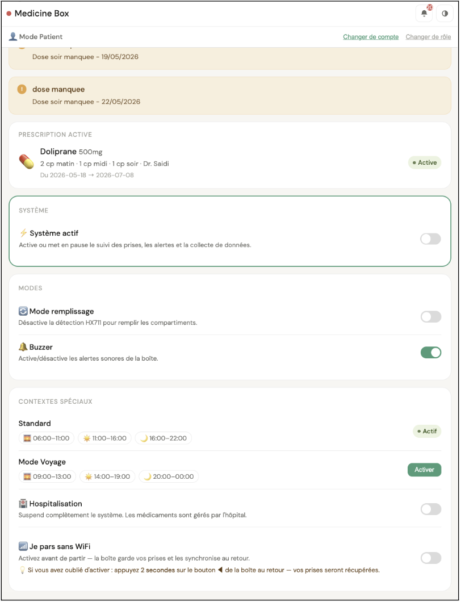
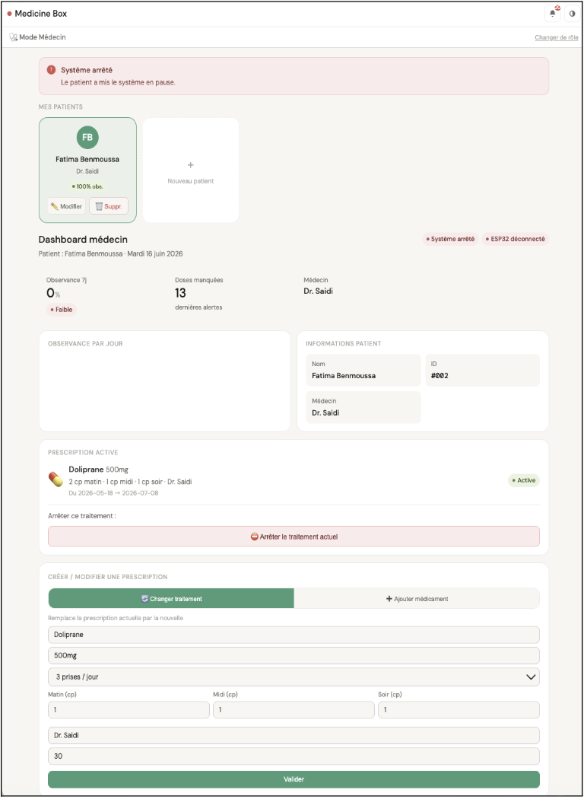

# Medicine Box

Smart IoT pill dispenser that tracks real medication intake and predicts the best reminder time for each patient using per-patient machine learning models.

[🇫🇷 French version](README.fr.md)


## Demo

[](https://youtu.be/bXz71IvDXHM)
<p align="center">
  
</p>

## Overview

Missed medication doses are common, particularly for multi-dose daily treatments and elderly patients living alone. A survey of 40 respondents conducted during the design phase showed that most people forget doses "often" or "sometimes," and 85% considered automatic confirmation of intake (not just a reminder sound) important.

Medicine Box is a rotating-tray pill dispenser that:
- Splits doses into a 7-day x 3-dose tray
- Uses a load cell to confirm a dose was physically removed, not just that an alarm went off
- Learns each patient's actual intake timing and adjusts reminder times accordingly
- Provides a web dashboard for patients and doctors/caregivers

## Features

- 22-slot rotating tray (7 days x 3 doses + reference slot), driven by a stepper motor
- Load-cell based intake detection using amplitude-spike filtering to avoid false positives from hand contact
- Per-patient ML pipeline (Isolation Forest + Random Forest) that predicts optimal reminder times after a 7-day learning phase
- Patient dashboard: today's doses, adherence history, missed-dose alerts, forgetting-risk score
- Doctor dashboard (PIN-protected): prescriptions, multi-patient management, manual alert trigger
- Configurable schedule profiles, per-patient or global (e.g. travel, Ramadan)
- Offline mode: device keeps logging doses without Wi-Fi and syncs on reconnect

## Architecture

```
ESP32 (firmware) <--MQTT/TLS--> FastAPI backend (Render) <--SQL--> PostgreSQL (Supabase)
                                        |
                                        v
                              Web dashboard (Patient/Doctor)
                                        |
                                        v
                         ML pipeline (per-patient Isolation Forest + Random Forest)
```

<p align="center">
  
</p>

## Tech Stack

| Layer | Technology |
|---|---|
| Microcontroller | ESP32 (Arduino framework) |
| Motor control | 28BYJ-48 stepper motor + ULN2003A driver |
| Sensing | HX711 load cell amplifier, 2x reed switches |
| Display | 0.96" I2C OLED (128x32) |
| Messaging | MQTT over TLS (HiveMQ Cloud) |
| Backend | FastAPI (Python) |
| Database | PostgreSQL (Supabase) |
| Hosting | Render |
| ML | scikit-learn (Isolation Forest, Random Forest classifier/regressor) |
| Frontend | HTML/JS single-page dashboard |

## Machine Learning

Each patient has an independent model profile (`ml/models/patient_{id}/`) rather than a single global model.

1. Discovery phase (first 7 days): fixed schedule, logging every actual intake.
2. Isolation Forest flags unusual intake timing.
3. Random Forest classifier predicts whether a patient tends to be early, on time, or late (62.96% accuracy on held-out data).
4. Random Forest regressor predicts the delay in minutes from the scheduled window to actual intake (MAE: 49.4 minutes).
5. After the discovery phase, reminders switch from the fixed schedule to the model's prediction.

Note: real long-term patient data was not available at this stage. Models were trained and validated on a synthetic dataset built to reflect realistic adherence patterns (on-time, early, late, missed doses).

## Hardware

| Component | Role |
|---|---|
| ESP32 | Main microcontroller |
| 28BYJ-48 stepper + ULN2003A | Rotates the 22-slot tray |
| HX711 + load cell | Detects dose removal |
| 2x reed switches | Lid state and tray home position |
| 0.96" OLED (I2C) | On-device status display |
| Piezo buzzer | Audible reminder |
| 2x push buttons | Manual tray navigation |

Enclosure: round, 150mm diameter x 85mm height, 3D-printed.

<p align="center">
  
  
</p>

## Screenshots

<p align="center">
  
  
  
</p>

## Project Structure

```
medicine-box/
├── api/            # FastAPI routes and business logic
├── db/             # Database schema / migrations
├── firmware/       # ESP32 Arduino firmware
├── ml/             # Training, prediction, per-patient models
├── mqtt/           # MQTT client/config
├── app.py          # Application entry point
├── index.html      # Web dashboard
├── requirements.txt
├── pyproject.toml
└── render.yaml     # Render deployment config
```

## Getting Started

```bash
git clone https://github.com/fatimakaram01-creator/medicine-box.git
cd medicine-box
pip install -r requirements.txt
```

Set environment variables for the Supabase (PostgreSQL) connection and HiveMQ Cloud MQTT credentials, then run:

```bash
python app.py
```

Firmware is in `/firmware` and can be flashed via the Arduino IDE or PlatformIO.

## Context

Developed as a supervised capstone project during my engineering studies. I designed and implemented the full system independently: circuit design, firmware, backend, database, MQTT integration, ML pipeline, and web dashboard.

## Future Work

- Unified reminder logic covering the first 7 days before a schedule is seeded
- Push notifications for caregivers
- Larger dataset for improved ML accuracy

## License

MIT — see [LICENSE](LICENSE).
